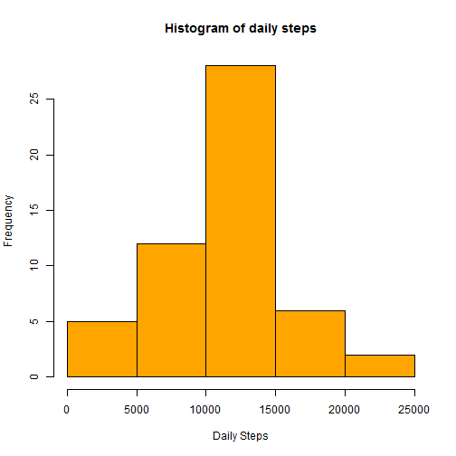
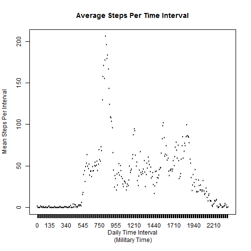
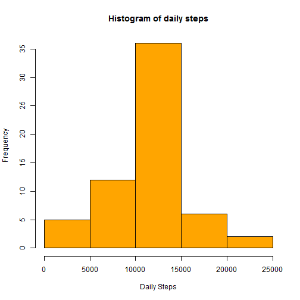
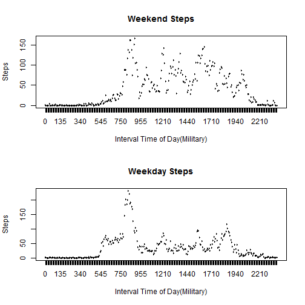

## Loading and preprocessing the data

1. Set the current working directory to find the forked and  
cloned repo.


```r
setwd("C:/Users/ZAREK/Documents/R_Projects/Hopkins_Reproduceable_Research/RepData_PeerAssessment1")
```
2. Load the proper packages for this exercise. Need to  
install and select the "stats","sqldf",and "dplyr"  
libraries.

```r
library("sqldf")
library("dplyr")
library("stats")
library("RSQLite")
library("DBI")
```
3. Set current working directory to forked and cloned repo


```r
setwd("C:/Users/ZAREK/Documents/R_Projects/Hopkins_Reproduceable_Research/RepData_PeerAssessment1")
```
4. Unzip the file folder and read the data into 'R'.


```r
unzip("activity.zip")
data<-read.csv("activity.csv")
```
5. Process and transform the data for analysis.Convert  
variables to Date type and aggregate by day.Rename column  
headings in aggSteps object.


```r
data$interval<-as.factor(data$interval)
data$date <- as.Date(data$date,format="%Y-%m-%d")
aggSteps<-aggregate(data$steps,by=list(data$date),FUN = sum)
names(aggSteps)<-c("date","total.steps")
```

## What is mean total number of steps taken per day?

1. Create a histagram of the total number of steps taken each  
day. First convert the steps column in aggSteps object  
to numeric to build the histogram.


```r
aggSteps$total.steps<-as.numeric(aggSteps$total.steps)
hist(aggSteps$total.steps,col ="orange",main ="Histogram of daily steps",xlab = "Daily Steps")
```

 


2. Calculate the mean and median total number of steps taken  per day.

### Mean Calculation:

```r
mean(aggSteps$total.steps,na.rm=TRUE)
```

```
## [1] 10766.19
```
### Median Calculation:

```r
median(aggSteps$total.steps,na.rm=TRUE)
```

```
## [1] 10765
```
## What is the average daily activity pattern?

1. Aggregate data by daily interval and find average across  
each interval.Rename columns.


```r
aveSteps<-aggregate(data$steps, list(data$interval), mean,na.rm=TRUE)
names(aveSteps)<-c("interval","average")
```
2. Create a time series plot of 5 minute interval(x-axis) and average number of steps taken across all days.


```r
plot(aveSteps$interval,aveSteps$average,type = "l", main = "Average Steps Per Time Interval", xlab = "Daily Time Interval
 (Military Time)",ylab = "Mean Steps Per Interval")
```

 


3. Determine which five minute interval, on average across all days in the data set contains the maximum number of steps.


```r
 aveSteps[which.max(aveSteps$average),]
```

```
##     interval  average
## 104      835 206.1698
```

## Imputing missing values

1. Calculate the total number of missing values in the data set.  
First determine complete cases.


```r
complete<-complete.cases(data)
```
2. The total missing cases are:


```r
sum(!complete)
```

```
## [1] 2304
```
3. The strategy to address all of the missing cases is to create  
a new data set that replaces any missing data.step values in the data object with the mean of the interval of that respective data  
point.We join the existing data frames using some SQL.  


```r
data2 <- sqldf("SELECT steps, date, interval,average
 FROM data LEFT JOIN aveSteps USING(interval)")
```
4. Replace missing values with the average values.


```r
data2$steps <- ifelse(is.na(data2$steps),data2$average, data2$steps)
```
5. Clean up variables and make a histagram of the new data set

```r
aggImpSteps<-aggregate(data2$steps,by=list(data$date),FUN = sum)
names(aggImpSteps)<-c("date","steps")
hist(aggImpSteps$steps,col ="orange",main ="Histogram of daily steps",xlab = "Daily Steps")
```

 


6. Calculate summary statistics of new data set

###Calculate mean

```r
mean(aggImpSteps$steps)
```

```
## [1] 10766.19
```
###Calculate median

```r
median(aggImpSteps$steps)
```

```
## [1] 10766.19
```
7. The impact of replacing NAs in the new data set has shifted   the mean and median closer together.The values did not change  
significantly.
 

## Are there differences in activity patterns between weekdays and weekends?

1. Clean up data object from previous step.


```r
data2<-data2[,1:3]
```

2. Subset the data by weekday and weekend. Create new factor  
variable for day of week category


```r
weekDay<-c("Monday","Tuesday","Wednesday","Thursday","Friday")
weekEnd<-c("Saturday","Sunday")
data2$dayOfWeek<-weekdays(data2$date,abbreviate = FALSE)
data2$dayOfWeek<-as.factor(data2$dayOfWeek)
weekDays<-data2[data2$dayOfWeek %in% weekDay,]
weekEnds<-data2[data2$dayOfWeek %in% weekEnd,]
```
3. Compute interval averages across both weekend and weekdays.

```r
aveWeekDay<-aggregate(weekDays$steps, list(weekDays$interval), mean,na.rm=TRUE)
aveWeekEnd<-aggregate(weekEnds$steps, list(weekEnds$interval), mean,na.rm=TRUE)
```
4. Construct panel time series plot of 5minute intervals across  
weekdays and weekends.


```r
par(mfrow=c(2,1))
with(aveWeekEnd,{

plot(aveWeekEnd$Group.1,aveWeekEnd$x,type ="l",main = "Weekend Steps",xlab = "Interval Time of Day(Military)",ylab = 
"Steps")}
)
with(aveWeekDay,{

plot(aveWeekDay$Group.1,aveWeekDay$x,type ="l",main = "Weekday Steps",xlab = "Interval Time of Day(Military)",ylab = 
"Steps")}
)
```

 
